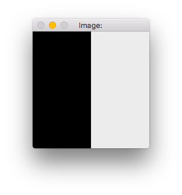

#OpenCV in Xcode

### Environment
- OS X El Capitan
- OpenCV 3.1.0
- Xcode 7.3

###1. You need to
#####Download OpenCV
Click download OpenCV for Linux/Mac at here.  **http://opencv.org/downloads.html**  

#####Download XCode
You can download Xcode in App Store.  

#####Install Command line tools
```
$ xcode-select --install
```
#####Install Brew
```
$ /usr/bin/ruby -e "$(curl -fsSL https://raw.githubusercontent.com/Homebrew/install/master/install)"
```


#####Install Cmake
```
$ brew install cmake
```
	
###2. Install

#####1) Unzip OpenCV-3.1.0 at ~/OpenCV directory.  
Open terminal and type this command.

```
$ mkdir OpenCV
$ cd Downloads/
$ unzip opencv-3.1.0.zip -d ~/OpenCV/
```

#####2) Build OpenCV  
Open terminal and type these commands.

```
$ cd OpenCV/
$ cmake -G "Unix Makefiles"
$ make -j8
$ sudo make install
```		

###3. Create OpenCV project in Xcode

#####1) Open Xcode and select create a new project.  
Select OS X - Command Line Tool.

#####2) Input your product name and set language to C++
In this case, I give a name as "OpenCV_Test".

#####3) Assigning the Search Paths
- Click your project then, you can see four tabs in main window.  
- Click Build Settings and option All.  
- Scroll down until you find **Search Paths**

- Edit Library Search Paths options as

    ```
    /usr/local/include
    ```
		
- Edit Library Search Paths options as

    ```
    /usr/local/lib
    ```	
   
#####4) Add opencv frameworks
- Make a new group at left side bar.
- Click Add Files to "OpenCV_Test"...
- Type **/usr/local/lib**
- Add opencv framework you need. ( libopencv_[libname].dylib )

Now, you can build your opencv project.

#####5) Location proeference
- Open Xcode preferences, select location tab.  
- Click Advanced.  
- Change the location button from Unique to Legacy.  

This setting allows you to access result binary file at

```
[Your Xcode Project Location]/build/Debug/
```
  
---  


###Example Code for OpenCV
```
#include <iostream>
#include <opencv2/opencv.hpp>

int main(int argc, char *argv[]) {
    IplImage *img = cvCreateImage(cvSize(100,200), IPL_DEPTH_8U, 3);
    
    cvNamedWindow("Image:", CV_WINDOW_AUTOSIZE);
    
    cvShowImage("Image:", img);
    
    cvWaitKey(0);
    
    cvDestroyWindow("Image:");
    cvReleaseImage(&img);
    
    return 0;
}
```

#####If you can see a window like this, you're ready for opencv programming.
