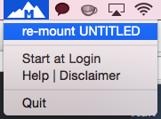
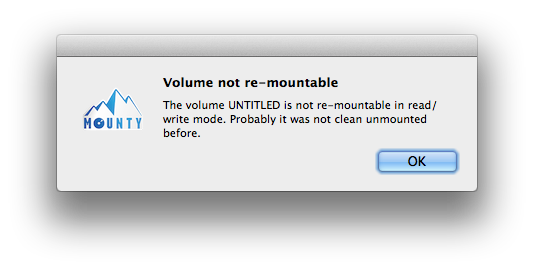

#Read and Write NTFS on Mac OS X
###A tool to re-mount write-protected NTFS volumes under Mac OS X in read-write mode.

1) Install
 
```
 $ brew cask install mounty	
```

2) Run Mounty application

```
 $ open /Applications/Mounty.app
```

3) Re-mount NTFS volumes from the icon in menu bar


###Error can be occured 

This can happen when the USB stick is not cleanly unmounted from the Windows PC. If you simply unplug the USB stick from PC without using the little tray icon to detach the hardware correctly, the volume will be marked as "not cleanly unmounted". There might be some dirty sectors left and Mac OS X will not be able to re-mount in read-write mode for that reason.