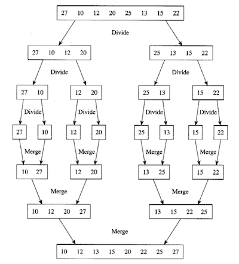

#MergeSort

###Divide and Conquer algorithm

####Divide
배열을 각각 n/2개의 데이터로 만들어진 두 개의 부분배열로 분할한다.

####Conquer
나누어진 부분배열에 대하여 재귀적으로 합병 정렬을 수행한다.  
단, 데이터의 개수가 1개인 경우에는 그 자체로 정렬된 상태이다.

####Combine (Merge)
두개의 이미 정렬된 부분배열을 통합하여 n개의 정렬된 배열로 만든다.

####Example


####Analysis
배열을 각각 n/2개의 원소를 갖는 두 개의 부분배열로 분할 => O(n)

각 단계마다 O(n)회의 merge 수행  
O(logn) 개의 단계 존재

Total time = O(nlogn)

```
T(n) = 		0		(n = 1)
	   2T(n/2) + n 	(n > 1)

=> O(nlogn)
```


####Implementation
```
#define MAX_SIZE 100

void merge(int arr[], int low, int mid, int high) {
	int i, j , k;
	int tmp[MAX_SIZE];

	for (i = low; i <= high; i++) 
		tmp[i] = arr[i];

	j = k = low;
	j = mid + 1;

	while (i <= mid && j <= high) 
		if (tmp[i] <= tmp[j])
			a[k++] = tmp[i++];
		else
			a[k++] = tmp[j++];

	while (i <= mid)
		a[k++] = tmp[i++];
	
	while (j <= high)
		a[k++] = tmp[j++];
}

void mergeSort(int v[], int low, int high) {
	int mid;

	if (low == high)
		return;

	mid = (low + high) / 2;

	mergeSort(v, low, mid);
	mergeSort(v, mid+1, high);
	merge(v, low, mid, high);
}

void main() {
	int i, v[MAX_SIZE] = { 5, 6, 9, 4, 0, 2, 1, 7, 3, 8 };

	mergeSort(v, 0, 9);
}
```

