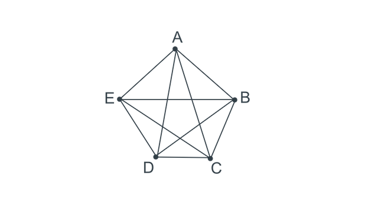

#Graph Theory
##Definitions
Graph theory was developed by *Leonhard Euler* to solve the **Konisberg Bridge Problem**.

```
	    v1  -----
   e1 /    \ e2   \ e7
      \    /   e6  \
		v2  ------ v4
       /  \       /
    e3 \  /  e4  / e5
        v3  -----

```
**Problem)** Starting and ending at the same point, is it possible to cross all seven bridges just once and return to the same point?  
**Answer)** No path exists. &nbsp;&nbsp;&nbsp;&nbsp;&nbsp;&nbsp;**Euler Path: Even edges leaving vertices**  

Directed Graph - has arrow(direction)  
Undirected Graph - no arrow(no direction)

###Undirected graph
Graph G is a pair G = (V, E), where  
V = V(G) = set of vertices  
E = E(G) = set of edges

Example )  
```
	a - b - c		V = {a, b, c, d}
	\  /			E = {{a,b}, {b,c}, {a,d}, {b,d}}
	 d
```

###Edges
- An edge may be labled by a pair of vertices, for instance e = (u, w).  
&nbsp;&nbsp;&nbsp;&nbsp;e is between u and w and u  
&nbsp;&nbsp;&nbsp;&nbsp;u is **adjacent** to w  
&nbsp;&nbsp;&nbsp;&nbsp;edge e **connects** u and w  
&nbsp;&nbsp;&nbsp;&nbsp;e is **unordered pair**, rather than (u, w) != (w, u)
- e is said to be *incident* on v and w.
- Isolated vertex = a vertex without incident

###Special edges
- Parallel edges  
&nbsp;&nbsp;&nbsp;&nbsp;Two or more edges joining a pair of vertices  
&nbsp;&nbsp;&nbsp;&nbsp;In the example, **A** and **B** are joined by two parallel edges
- Loops  
&nbsp;&nbsp;&nbsp;&nbsp;An edge that starts and ends at the same vertex  
&nbsp;&nbsp;&nbsp;&nbsp;In the example, vertex **C** has a loop.  
- Multi-graph  
&nbsp;&nbsp;&nbsp;&nbsp;The graph that allows multiple edges.
Example) 
```
    ---          __
  /     \       /  \
 A ----  B --- C    |
  \     /       \__/
    ---
```
###Special graphs
- Simple graph  
&nbsp;&nbsp;&nbsp;&nbsp;A graph without loops or parallel edges  
- Weighted graph  
&nbsp;&nbsp;&nbsp;&nbsp;A graph where each edge is assigned a numberical label or *weight*.

###Subgraph, Directed Graph
- Subgraph  
Let G = (V, E) be a graph.  
Let G' = (V', E') be another graph, such that if then G' is **subgraph** of G.  
V' ⊆ V and E' ⊆ E

- Directed Graph  
G is **directed graph** or **digraph** if each edge has been associated with an ordered pair of vertices.

###Complete graph Kn
The complete graph Kn is the graph with n vertices and every pair of vertices is joined by an edge  
Figure represents K5, (when n >= 3)  
Edges for Kn = n(n-1)/2  
Every graph is a subgraph of Kn  


###Connected graphs
A graph is *connected* if every pair of vertices can be connected by a path.  
(strongly connected : (a, b) 


--
##Path and Cycle
--
###Graph Property
