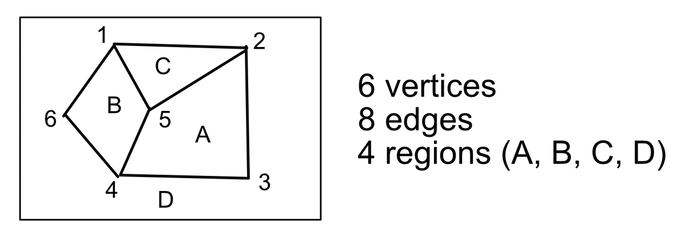
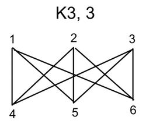

#Planar Graph

###A Graph is *planar* if it can be drawn in the plane without crossing edges

#Finite Planar Graph (MAP)

###Property
* Map divides the plane into various regions (faces)
* We can assume a map is contained in large rectangle
* **The sum of degrees of the regions of map is equal to twice the number of edges**

###Theorem
1. ####`Sum of Degrees = 2|E|`  

2. ####**Euler's formula** : `F = E - V + 2 ( or V - E + F = 2 )`  
> It is used to show certain Graph is not planar  

3. ####**By theorem 1 and 2** `If G is connected & V ≥ 3 then, E ≤ 3V-6`

###Example 1
In above figure, V = 6, E = 8, F = 4.  
F = 8 - 6 + 2 = 4  
The graph is planar graph.

###Example 2
A connected planar graph has nine vertices having degrees, 2,2,2,3,3,3,4,4,5. How many edges are there? How many faces are there?

2E = 2 + 2 + 2 + 3 + 3 + 3 + 4 + 4 + 5 = 28  
E = 14, V = 9, F = 14 - 9 + 2 = 7

###Example 3
Why can there not exist a graph whose degree sequence is 5,4,4,3,2,1?

Because sum(d) is 19, which is not even, not 2|E|

###Example 4
Show that K3,3 is not planar

V = 6, E = 9. By Euler's formula, F = 9 - 6 + 2 = 5.  

###Example 5

V = 5, E = 10, 3V - 6 = 3x5 - 6 = 9.  
E = 10, 10 ≤ 9 The graph is not Planar

#Vertex Coloring

Skip
