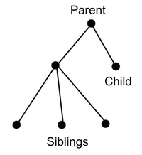
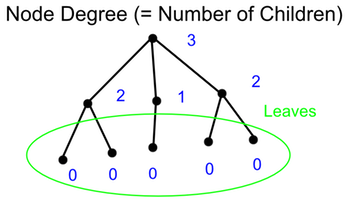

#Tree

1. [Introduction](#introduction)  
1.1 [Tree Terminology](#tree-terminology)

2. [Spanning Trees](#spanning-trees)  
2.1 [Tree Search](#tree-search)
2.2 [Minimum Spanning Tree(MST)](#minimum-spanning-tree(MST))

3. [Binary Tree](#binary-tree)  
3.1 [Properties](#properties)  
3.2 [Tree Traversal](#tree-traversal)  
3.3 [Binary Search Tree(BST)](binary-search-tree(BST))  
3.4 [Other Properties of Trees](other-properties-of-trees)  

#Introduction
A Graph is a **Tree** if graph is ***connected*** and ***acyclic***.
* A simple graph such that for every pair of vertices v and w, 
there is a unique path from v to w
* Representation method for expression evaluation in sorting and searching
* Hierarchical Representation

##Tree Terminology
**Root** : One of elements in a tree

**Level** : Lengh of the simple path from a vertex to the root of the tree.

**Height** : The maximum of all level numbers of its vertices. (= Number of levels)

**Internal vertex** : A vertex that has at least one child (**non leaf node, non-terminal**)

**Terminal vertex** : A vertex that has no children (**leaf node**)

###Characterization of Trees
###Theorem
1. Graph T is a tree
2. T is connected and acyclic (no cycles)
3. T is connected and has n-1 edges
4. T is acyclic and has n-1 edges
5. There exists one path between any pair of vetices in T
6. If remove any edge -> disconnects T
7. Acyclic and adding any edge -> creats a cycle

#Spanning Trees
Given a graph G, a tree T is a ***spanning tree*** of G iff;  
**T is a subgraph of G** and **T contains all the vertices of G**
##Tree Search
###Breadth First Search (BFS)
1) Let's start with 'a'  
2) Add all edges (a, x), x = b to h, which does not create a cycle x = g, c, b at level 1 (a, g), (a, c), (a, b)  
3) repeat this process at level 1

###Depth First Search (DFS)

##Minimum Spanning Tree(MST)
Given a weighted graph G, a ***minimum spanning tree*** is  
**a spanning tree of G that has minimum "weight"**

###Kruskal's algorithm

###Prim's algorithm

#Binary Tree
##Properties of Binary Tree
##Tree Traversal
##Binary Search Tree(BST)
