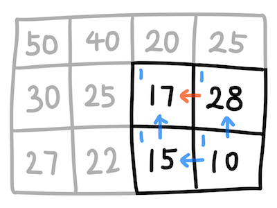
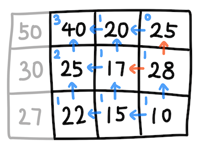
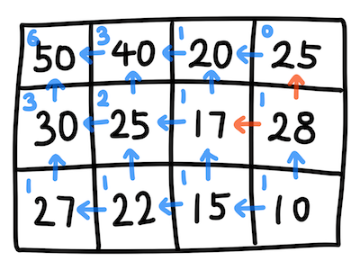

# 내리막길
세로 길이 M, 가로 길이 N인 2차원 행렬의 각 지점에 숫자가 주어질때, 시작점(0, 0)에서 끝점(M, N)까지 이동할 수 있는 경우의 수를 구하는 문제이다. 단, 자신에게 적힌 숫자보다 더 작은 숫자를 갖는 지점으로만 이동할 수 있다.

## 풀이
Working backwards로 해결 방법을 생각해볼 수 있다. 	그림으로 설명을 대체함.







점화식은 아래와 같다.
```
해당 지점까지의 경로의 경우의 수를 F(M, N), 해당 지점에 적혀있는 숫자를 H(M, N)이라고 하면
F(M, N) = F(M + 1, N) + F(M, N + 1),    H(M, N) < H(M + 1, N) & H(M, N) < H(M, N + 1)
F(M, N) = F(M + 1, N),                  H(M, N) < H(M + 1, N) & H(M, N) >= H(M, N + 1)
F(M, N) = F(M, N + 1),                  H(M, N) >= H(M + 1, N) & H(M, N) < H(M, N + 1)
F(M, N) = 0,                            H(M, N) >= H(M + 1, N) & H(M, N) >= H(M, N + 1)
```

## 문제 링크
[내리막길](https://www.acmicpc.net/problem/1520)

## 소스 코드
[Downhill.py](./Downhill.py)
